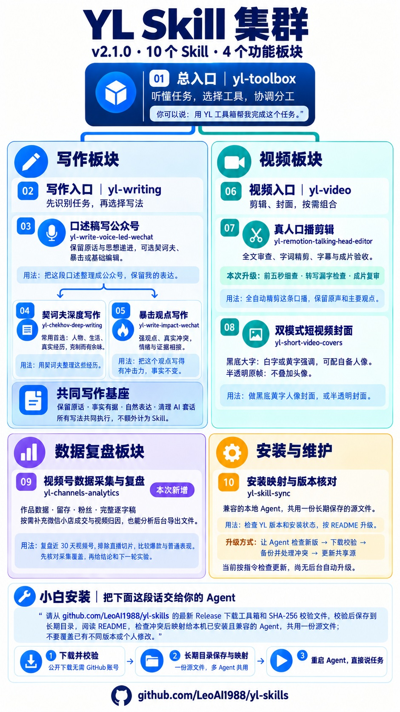

# yl Skill 集群

把经过实际使用的写作、剪辑和封面工具整理成可独立安装的公开工具箱。当前版本 **2.1.1**（10 个 Skill）。总入口选工具，分类入口选风格，具体 Skill 完成工作。

## 日常版与公开版

日常 Codex 中的 Skill 持续迭代，是功能演进的来源；本项目是审核后的公开发行版。这里保留完整方法，另外处理隐私、相对路径、环境依赖和合法署名。它不是日常目录的原样备份，也不会反向修改日常版。

日常升级后先核对差异，再把适合公开的变化合并到这里，审核通过后发新版本。架构见 [PRD](PRD.md)，流程见 [维护指南](MAINTAINING.md)。

## 工具箱一览

当前结构：`yl-toolbox` → 写作（入口＋口述框架＋契诃夫＋暴击）、视频（入口＋口播剪辑＋双模式封面）、数据复盘（视频号／按需小店）、安装维护。



海报标注 v2.1.0 能力架构；v2.1.1 将这张新版海报加入仓库和安装包，Skill 能力不变。

## 有哪些工具

| 入口 | 成员／选择 |
| --- | --- |
| `yl-toolbox` | 工具箱总入口，支持同一任务的多 Skill 分工 |
| `yl-writing` | 口述稿写公众号总框架；**契诃夫深度写作（常用首选）**、暴击／咪蒙式观点；全部内置共同写作基座 |
| `yl-video` | 真人口播自动剪辑、黑底白字封面、半透明无头像封面 |
| `yl-channels-analytics` | 视频号后台采集、逐字稿、留存与粉丝复盘；按需小店成交归因 |
| `yl-skill-sync` | 本地目录映射和安装状态核对；自动下载更新待完善 |

口述稿总框架为 `yl-write-voice-led-wechat`。两个风格成员为 `yl-chekhov-deep-writing`、`yl-write-impact-wechat`。卡兹克和 Human Writing 已退出独立成员，适用的自然表达与证据方法并入公共基座，无需另装。视频成员是 `yl-remotion-talking-head-editor` 和 `yl-short-video-covers`。

封面两种模式在同一个 Skill 中选择：黑底白字可少量黄字强调；半透明模式保留真实原帧、不叠加头像。写作优先使用安装者自己的原稿、事实和表达。

## 安装

把下面一句话复制给 Agent，无需事先下载或发送安装包：

```text
请从 https://github.com/LeoAI1988/yl-skills/releases/latest 下载最新工具箱 ZIP 和 SHA-256 校验文件，校验后解压到长期保留的目录，阅读 README，按本机已安装且兼容的各 Agent 的官方 Skill 规范，共用一份源文件建立安装映射；先检查冲突，不覆盖已有不同版本或个人修改，安装后验证并告诉我如何调用。
```

Agent 安装步骤：从最新 Release 读取 ZIP 和同名 `.sha256` 附件，下载并比较 SHA-256；先检查压缩包路径安全，再解压到长期目录。阅读本目录说明，用 `install.py --dry-run` 检查各 Skill 哈希和目标冲突。需要多个 Agent 共用时，先核实当前客户端支持的 Skill 目录，再在已确认的目录建立指向这份长期源文件的链接；不因某个宿主目录存在就假定兼容。保留旧版及个人修改，不能自动删除退役入口。普通复制安装可按下面命令执行。

当前 `yl-skill-sync` 的 URL 下载、更新和 Grok 适配有已知缺口，安装过程不要直接运行这些旧命令；由 Agent 完成上述显式下载与兼容映射流程。后台自动升级尚未实现。

解压 `yl-toolbox-cluster.zip`，进入解压后的 `yl-toolbox-cluster` 目录。查所用 Agent 的官方 Skill 安装位置，再运行（Python 3.10 或更新版本）：

```text
python install.py --target "你的 Agent 的 skills 目录" --dry-run
python install.py --target "你的 Agent 的 skills 目录"
```

安装器校验全部文件后一次安装 10 个 Skill，支持重复安装相同内容，拒绝覆盖不同内容。更新前在 Skill 安装目录之外备份旧版，再移开需要更新的旧目录后安装。也可手动复制全部 `yl-*` 目录；不要把外层项目目录当作一个 Skill。

安装后重新加载或重启 Agent。成员可以单独安装；分类入口和口述总框架需要所选风格成员同时安装在同级目录；口述框架自带的基础编辑模式可独立使用。安装器不修改 Agent 全局设置、不安装第三方依赖、不配置账号。

## 怎么用

- “用 yl 工具箱帮我写文章，先看看有哪些风格。”
- “用口述稿写公众号，保留我的原话，用契诃夫框架；也可以换暴击表达或只做原稿修补。”
- “用契诃夫深度写作整理这段录音，保留我的原话和真实经历。”
- “用 yl 写作基座整理这篇产品体验稿，讲清实际用途，保留真实体验。”
- “用 yl 全自动剪这条口播，再做黑底白字封面。”
- “用 yl 做半透明封面，不要加头像。”

也可以调用 `$yl-toolbox`、`$yl-writing`、`$yl-video` 或具体成员。剪辑的全自动／半自动与封面的视觉模式是两种不同选择，已选定就沿用。

跨 Agent 本地映射使用 `$yl-skill-sync`：从长期保留的解压源目录建立公共或专属链接，兼容且已安装的客户端共用源文件。不要移动或删除源目录；本机兼容性需实际核对。当前下载与自动升级链路仍有目录定位和持久化缺口，没有后台检查任务，暂不把 URL 下载/自动升级作为可交付能力；可先手动获取已发布 ZIP。

## 写作的共同规则

所有框架与风格都必须执行 [公共写作约束](yl-writing/references/writing-foundation.md)：写前检查原稿与材料，写后逐项复核，修掉确认的套话、空转、伪深刻、假经历和机械句式。直接调用风格成员也适用，单独安装时规则随成员携带。

[完整规则](yl-writing/references/anti-ai-rules.md) 收录 Human Writing 的 16 组规则、卡兹克机制包提取的 5 组共通方法、DBS 的 22 项特征及其他写作模块补充；[提取账](yl-writing/references/anti-ai-extraction.md) 记录来源、版本指纹和改编理由。检测脚本只定位候选，零命中不能保证文章没有 AI 味；真实原话、有效修辞和术语须结合语义保护。

## 环境与来源

写作需要支持读取 Skill 的 Agent；事实核验使用当前可用检索能力。视频工具按成员说明准备 FFmpeg、Python 库、中文字体和可选外部服务。素材、输出和凭据放在 Skill 目录之外。

契诃夫成员附带可检索的俄文原著 clean 文本；这是当前 12 部作品研究线，不是全集，不含现代中文译本。原作、开放转录与整合代码的权利分别处理，见成员说明。

项目自己的代码与整合文档采用 [MIT](LICENSE)；第三方方法、原作和文件保留各自许可，见 [来源与许可](THIRD_PARTY_NOTICES.md)。新增 `yl-` 前缀不会改变原作者归属。

**许可说明：剪辑工作流、口述稿中的 DBS 编辑方法，以及所有写作成员附带的公共去 AI 味衍生文档，按 CC BY-NC 4.0 保留非商业限制。** 整个 ZIP 是多许可的源码公开包，不能统一作为无限制商用的 MIT 包。原有方法与脚本按文件保留原许可；使用或分发包含受限材料的完整成员时须遵守非商业条件或另获授权。安装者文章不自动改授此许可。

## 版本与分享

首版 `1.0.0`；兼容新增升 `1.1.0`、`1.2.0`，修复升 `1.0.1`，重大不兼容变化升 `2.0.0`。变更见 [CHANGELOG](CHANGELOG.md)。

分享根目录 `yl-toolbox-cluster.zip`，或单独的已审核 Skill 目录。固定名 ZIP 与带版本 ZIP 字节相同，并附 SHA-256。`cluster.json` 验证文件完整性，不是作者身份签名。

公开仓库为 [LeoAI1988/yl-skills](https://github.com/LeoAI1988/yl-skills)。通过 [最新 Release](https://github.com/LeoAI1988/yl-skills/releases/latest) 获取公开发行附件；新版十项工具宣传图随 ZIP 分发；2.1.0 新增数据复盘及剪辑检查，2.1.1 同步新版海报，最新能力以清单为准。项目不默认创建定时任务。

从旧版迁移：`yl-kazik-writing`、`yl-human-writing` 不再发行。备份并检查安装者修改后，可由安装者移出这两个旧入口；安装器不会自动删除它们，也不会覆盖不同版本。原来请求自然润色的任务可交给 `yl-writing`，口述成文交给 `yl-write-voice-led-wechat`。日常个人原版不受本次整理影响。

最新英文名、中文名、简介和用法见 [Skill 清单](Skill清单_v2.1.0.md)。

本轮逐项比对与采用／排除说明见 [2.1.0 对齐报告](版本对齐_v2.1.0.md)。使用新入口可说：“用 yl-channels-analytics 复盘我的视频号近 30 天，排除直播切片，先核对采集覆盖；有带货数据再核对成交归因。”

当前数据复盘含逐字稿获取、保存、数据关联与分析，尚未包含完整的文稿入库、蒸馏、知识原子及表达资产管理流程。
