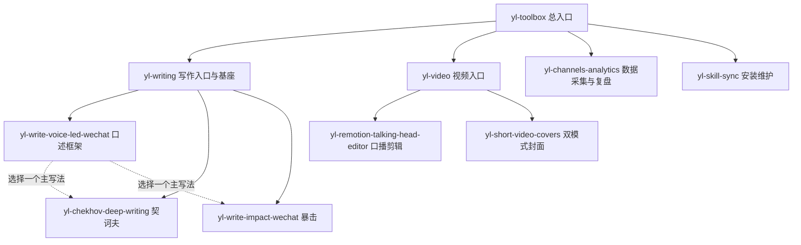

# YL Skill 清单 · v2.1.0

日期：2026-09-21。共 **10 个可安装 Skill**，分为写作、视频、数据复盘、安装维护四个板块，由工具箱总入口分派。

| 英文名 | 中文名 | 简介 | 用法示例 |
|---|---|---|---|
| `yl-toolbox` | YL 工具箱总入口 | 根据真实任务选择下方工具，可按任务依赖组合 | “用 yl 工具箱处理这份素材，选合适的工具。” |
| `yl-writing` | 写作入口与共同基座 | 选择契诃夫、暴击或基础编辑；所有写法执行原话保护和去 AI 味规则 | “用 yl-writing 整理这篇观点稿，先选文风。” |
| `yl-write-voice-led-wechat` | 口述稿写公众号 | 以口述全文为底板，保留判断、案例、原话和思想递进，可挂所选风格 | “把这段录音转写写成公众号，用契诃夫框架，保留我的原话。” |
| `yl-chekhov-deep-writing` | 契诃夫深度写作 | 常用首选；基于已研究机制与可检索俄文语料，用细节和人物处境约束判断 | “用契诃夫整理这些真实经历，不补造对白和心理。” |
| `yl-write-impact-wechat` | 暴击观点写作 | 以事实、冲突和高密度判断推进文章，保留作者的表达 | “用暴击风修这篇观点稿，增强开头，不编案例。” |
| `yl-video` | 视频制作入口 | 选择真人口播剪辑、封面或组合任务 | “用 yl-video 全自动剪这条口播，再做封面。” |
| `yl-remotion-talking-head-editor` | 真人口播自动剪辑 | 内容审查、字词精剪、停顿收紧、字幕及画质验收；新增 ASR 覆盖与成片复审检查 | “全自动剪这条视频，按最新停顿规则检查，保留原声。” |
| `yl-short-video-covers` | 双模式短视频封面 | 1080×1440：黑底白字／黄字强调可带授权人像；半透明原帧不叠加头像 | “用黑底黄字模式做封面，使用我提供的人像。”或“半透明模式，不加头像。” |
| `yl-channels-analytics` | 视频号数据采集与复盘 | 新增；采集作品、留存、粉丝、逐字稿，按需核对小店成交归因，也支持导出文件离线分析 | “复盘近 30 天视频号，排除直播切片，核对覆盖，比较爆款与普通表现。” |
| `yl-skill-sync` | 安装映射与版本核对 | 兼容宿主共用长期目录中的一份源文件；当前自动下载／后台升级仍有未修复限制 | “按 README 从最新 Release 下载并校验，检查冲突后映射到本机兼容 Agent。” |

## 隶属关系



数据复盘和安装维护各只有一个成员，该成员兼作板块入口。卡兹克、Human Writing 不再单独发行；适用的自然表达、证据和去 AI 味方法保留在共同基座。

## 安装口令

复制给能联网和操作本机文件的 Agent：

```text
请从 https://github.com/LeoAI1988/yl-skills/releases/latest 下载最新工具箱 ZIP 和 SHA-256 校验文件，校验后安全解压到长期保留的目录，阅读 README，检查本机已安装且兼容的各 Agent 的官方 Skill 目录，共用一份源文件建立安装映射；先检查冲突，不覆盖已有不同版本或个人修改，安装后验证并告诉我如何调用。
```

公开下载不要求注册 GitHub；使用者需要自己的 Agent 及相关运行环境。定期更新可让 Agent 重新检查最新 Release，按 README 的校验、备份与冲突保护流程升级；当前没有内置后台自动检查任务。兼容性需实际核实，不保证任意 Agent 都支持同一映射方式。

## 使用边界

写作原稿、真实经历、账号、媒体、模型和凭据由安装者提供；工具不会自带作者的私人资料。数据复盘不自动发布或修改后台，不采集不必要的客户联系方式。脚本检查不能替代听审、语义复核或真实后台验收。

整包为多许可源码公开工具箱。剪辑和写作中的 DBS 衍生方法仍受 CC BY-NC 4.0 非商业限制，详见 [来源与许可](THIRD_PARTY_NOTICES.md)。v2.1.1 包内海报已展示本清单的 10 项架构；本清单继续作为能力准本。
